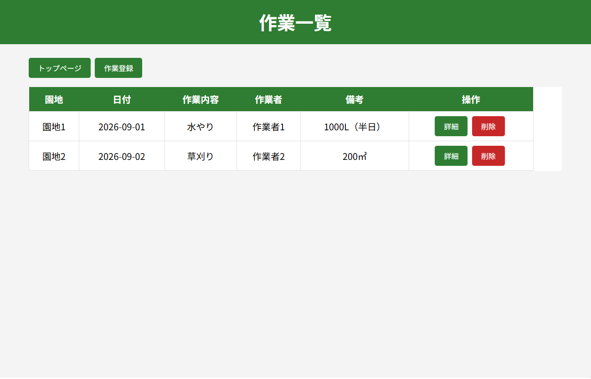
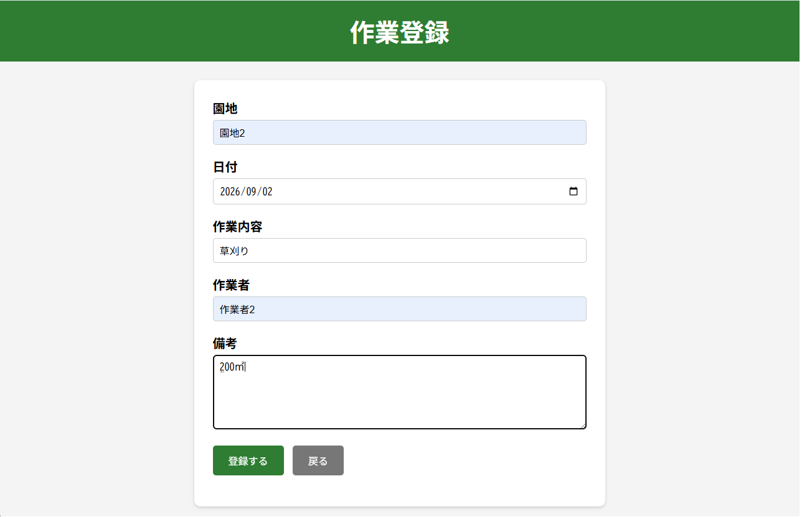
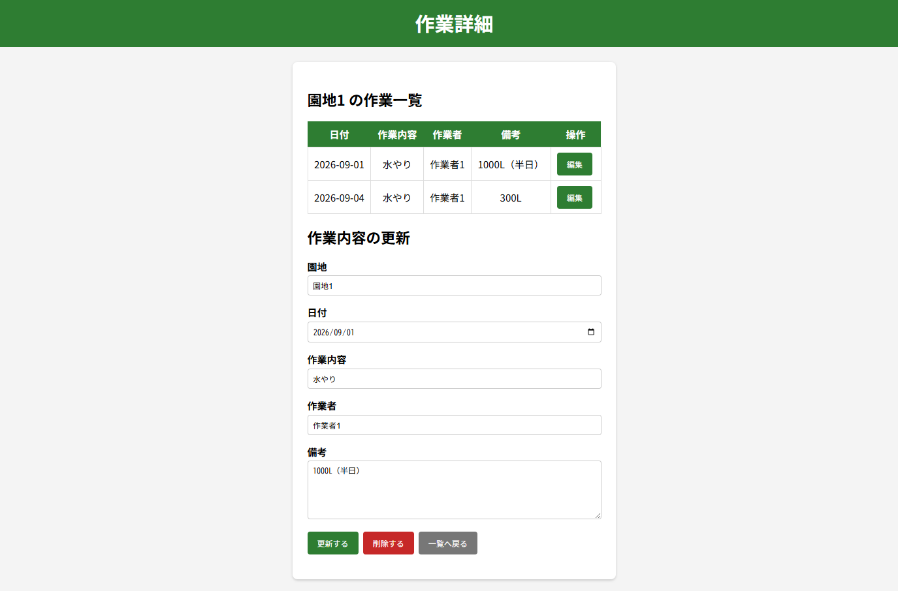
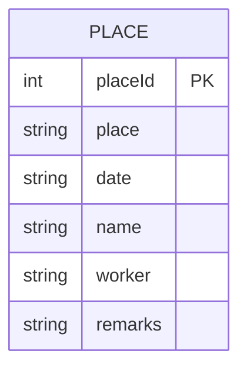
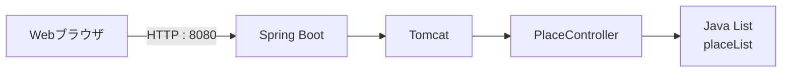

# 🌱 作業管理システム

## 「園地ごとの作業を、かんたん・わかりやすく管理」

農作業・園地作業の情報を登録・一覧表示・詳細確認・更新・削除できるWebアプリケーションです。

園地ごとに作業内容を管理し、日付・作業者・備考などを一元的に確認できることを目指して開発しました。

---

## 📌 アプリケーション概要

「作業管理システム」は、園地で行った作業を記録・管理するためのWebアプリケーションです。

以下の操作に対応しています。

- 作業情報の登録
- 作業一覧の表示
- 園地ごとの作業確認
- 作業詳細の表示
- 作業情報の更新
- 作業情報の削除
- 入力内容のチェック

### 管理する情報

項目 内容

---

園地 作業を行った園地名
日付 作業を行った日
作業内容 草刈り、水やり、収穫など
作業者 作業を担当した人
備考 作業に関する補足情報
園地ID 作業データを識別するID

---

## 🖼️ アプリケーションの雰囲気

### 作業一覧画面



### 作業登録画面



### 作業詳細画面



---

## 🌐 アプリケーションURL

現在はローカル環境で動作する構成です。

http://localhost:8080/

### 公開URL

https://work-management-xm8z.onrender.com/

---

## 🎯 開発した背景

農作業では、園地ごとに複数の作業が発生します。

例えば、

- いつ作業したのか
- どの園地で作業したのか
- どのような作業を行ったのか
- 誰が作業したのか
- 作業時にどのような注意事項があったのか

といった情報を整理して管理する必要があります。

そこで、作業情報をWeb上で簡単に登録・確認できる「作業管理システム」を開発しました。

特に、**同じ園地で行った複数の作業を確認しやすくすること**を意識しています。

---

# 📱 画面・機能説明

## 1. トップページ

システムの入口となる画面です。

作業一覧や作業登録画面へ移動できます。

---

## 2. 作業一覧

登録されている作業を一覧で表示します。

### 表示項目

- 園地
- 日付
- 作業内容
- 作業者
- 備考
- 操作

### 操作

- 「詳細」：作業詳細画面へ移動
- 「削除」：対象の作業を削除

---

## 3. 作業登録

新しい作業情報を登録します。

入力項目は以下の順番です。

```text
園地
↓
日付
↓
作業内容
↓
作業者
↓
備考
```

園地・日付・作業内容・作業者は必須入力です。

---

## 4. 作業詳細

選択した作業の詳細を確認できます。

また、同じ園地に登録されている作業をまとめて確認できるようにしています。

### 詳細画面でできること

- 作業情報の確認
- 作業情報の更新
- 作業情報の削除
- 作業一覧への戻る
- 同じ園地の作業確認

---

## 5. 作業更新

作業詳細画面から登録済みの作業情報を変更できます。

更新対象は、

- 園地
- 日付
- 作業内容
- 作業者
- 備考

です。

更新後は作業一覧へ戻ります。

---

## 6. 作業削除

不要になった作業データを削除できます。

削除前に確認メッセージを表示し、誤操作を防止しています。

---

# 🔌 API

現在のSpring Bootアプリケーションでは、以下のAPIを使用しています。

---

| HTTPメソッド | URL             | 内容               |
| :----------- | :-------------- | :----------------- |
| **GET**      | `/place`        | 作業一覧取得       |
| **GET**      | `/place/{id}`   | 作業詳細取得       |
| **GET**      | `/place/search` | 同じ園地の作業取得 |
| **POST**     | `/place`        | 作業登録           |
| **PUT**      | `/place/{id}`   | 作業更新           |
| **DELETE**   | `/place/{id}`   | 作業削除           |

---

# 🛠️ 主な使用技術

## バックエンド

- Java 17
- Spring Boot 3.4.0
- Spring Web
- Apache Tomcat

## フロントエンド

- HTML
- CSS
- JavaScript
- Fetch API

## 開発環境

- Eclipse
- Maven
- GitHub Desktop
- GitHub

## データ管理

現在はデータベースを使用せず、Javaの `List<Place>`
にデータを保持しています。

そのため、アプリケーションを再起動すると登録データは初期化されます。

---

# 🗂️ プロジェクト構成

```text
work-management/
├── src/
│   └── main/
│       ├── java/
│       │   └── com/
│       │       └── example/
│       │           └── workmanagement/
│       │               ├── Application.java
│       │               ├── Place.java
│       │               └── PlaceController.java
│       │
│       └── resources/
│           └── static/
│               ├── index.html
│               ├── place.html
│               ├── register.html
│               ├── detail.html
│               └── css/
│                   └── style.css
├── docs/
│   └── images/
│       ├── place-list.png
│       ├── register.png
│       └── detail.png
│
├── Dockerfile
├── pom.xml
├── README.md
└── .gitignore
```

---

# 🗃️ ER図

現在のシステムはデータベースを使用していないため、厳密な意味でのデータベースER図はありません。

ただし、アプリケーション上のデータモデルは以下のようになっています。



### Placeクラス

`Place.java` が作業データを表すモデルクラスです。

```text
Place
├── placeId
├── place
├── date
├── name
├── worker
└── remarks
```

---

# ☁️ インフラ構成図

現在はローカル環境でSpring Bootを起動する構成です。



### 現在の構成

```text
ユーザー
   ↓
Webブラウザ
   ↓ HTTP
Spring Boot
   ↓
Apache Tomcat
   ↓
PlaceController
   ↓
List<Place>
```

今後、データベースやクラウド環境を導入する場合は、インフラ構成を変更する予定です。

---

# 🚀 起動方法

## 1. プロジェクトを取得

GitHubからプロジェクトを取得します。

```bash
git clone https://github.com/Shi-Akasaka/work-management/
```

## 2. プロジェクトをEclipseで読み込む

Mavenプロジェクトとしてインポートします。

## 3. Spring Bootを起動

`Application.java` を実行します。

```java
SpringApplication.run(Application.class, args);
```

## 4. ブラウザからアクセス

```text
http://localhost:8080/
```

---

# 📝 開発で意識したこと

- 初めて利用する人でも操作しやすい画面構成
- 「園地 → 日付 → 作業内容 → 作業者 → 備考」の順番で統一
- 作業一覧から詳細画面へ簡単に移動できる構成
- 同じ園地の作業をまとめて確認できる機能
- 登録・更新・削除時の入力チェック
- 削除前の確認メッセージ
- REST APIを利用したフロントエンドとバックエンドの連携

---

# 🔮 今後追加したい機能

- データベースへの保存
- ログイン機能
- ユーザー管理
- 日付による検索
- 作業者による検索
- ページネーション
- 作業履歴の管理
- クラウドへのデプロイ
- スマートフォン向けUIの改善

---

# 👤 開発者

職業訓練でのWebアプリケーション開発課題として制作。

Java / Spring
Bootを使用したWebアプリケーション開発を学習しながら制作しました。
